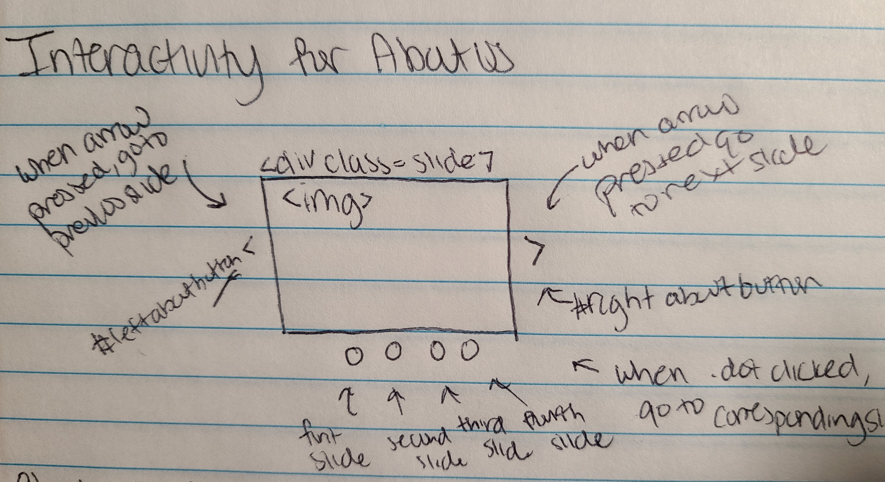
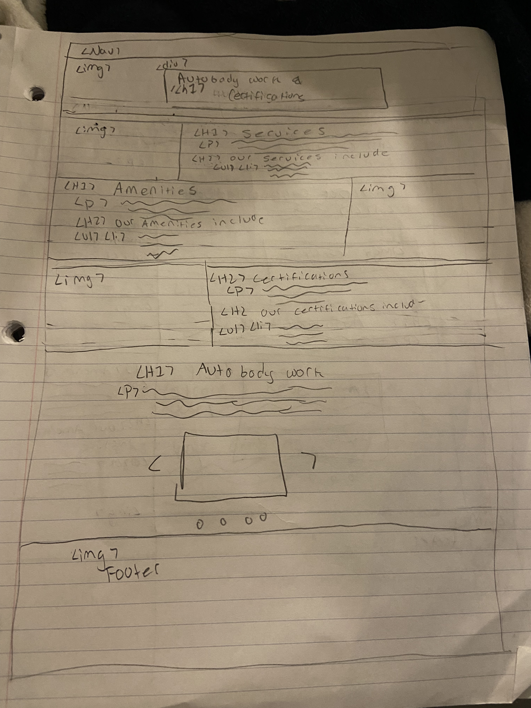

# Group Project: Design Journey

**You are encouraged to work ahead on everything on this project.** (Though we suggest you hold back on the interactivity until Project 3.) **Each section is required for a specific milestone. You are required to have these sections completed before that milestone's deadline.**

**Be clear and concise in your writing.** Bullets points are encouraged.

**Everything, including images, must be visible in Markdown Preview.** If it's not visible in Markdown Preview, then we won't grade it. We won't give you partial credit either. This is your warning.

# Client (Milestone 1)

## Client Questionnaire (Milestone 1)

1. Describe your organization and its purpose.

    The organization does "auto repair, mostly collision which is insurance related, small independent auto repair and repair community vehicles." Basically, the organization is an auto repair shop.

2. Why are you looking for a new website or updating your existing site?

    The website was made by a friend of the business owner and it has been incomplete for a very long time. The details of some pages are missing and labeled "coming soon". The website has been in this incomplete state for 8-10 years.

3. Who do you want to visit your site? Who is your site's target audience?

    The business itself firstly has an audience of people who need their car repaired as it is an auto repair shop. The website itself is designed for people under 30 who are more likely to use the internet to find things. Also the audience is limited geographically.

4. When visiting your site, what actions do you want your visitors to take?

    The site's visitors should mainly use the site to find information about the shop, it's location and contact information.

5. What are your goals for this site?

    - simplify website overall

6. Is there a "feel" that you want for your site? Are there colors or imagery that you have in mind?

    The feel should be similar to the current theme of the site but updated and more modern.

7. What are your three favorite competitors or similar organizations' sites? Why?

    The client did not have any information on their favorite competitor's sites.

8. Is there any information that you want removed from your sight or isn't necessary a lot of coming soon ?

    Basically to fill in the content that is labeled "coming soon", not to remove anything yet as all content is important, it can just be organized and presented better.

9. Do you want to provide us with content? What goes in the your rights section?

    Content will be provided.

## Client Description (Milestone 1)
> Tell us about your client. Who is your client?
> Explain why your client meets the client rules in the project requirements.

The client is Clark's Auto Body. They are an auto repair shop that repairs cars. This client meets the project requirements because they are in need of a modern website. Furthermore, the client matches the project requirements because they not one of us, none of us are a part of their shop, and we do not have a close personal relationship with the individual. Their current website is incomplete and the design can be improved to attract a new, younger audience. Also, the client is aware of our limitations and doesn't need anything that requires something that we haven't learned yet such as back-end programming. The client mainly needs the website to have a digital presence for the physical business which we can accomplish through reactive and interactive design.

## Client Website (Milestone 1)
> Tell us about the website that your client wants. Tell us the purpose of the website and what it is all about.
> NOTE: **If you are redesigning an existing website, give us the current URL and some screenshots of the current site.** (FireFox makes it easy to take a full screenshot of a page.) Tell us how you plan to update the site in a significant way that meets the project's requirements.

The client wants a working, finished, well-organized website. The navigation and the interactivity need to be fixed and they want a better mobile website. The purpose of the site will be to provide clients with information about the business, their services, and what they do. The website is about a local shop that is heavily pro-consumer, which the user should be able to tell observing it.

<https://clarksautobody.com>

**Desktop Screenshots**

**Mobile Screenshots**

## Client Website Scope (Milestone 1)
> Your project should be ambitious, but not too large. A good rule-of-thumb is that you should have about 1 content-full page for each team member.
> Explain why the website you will create for your client isn't too small and isn't too big. Explain why you think it's the right size for this project.

Mobile and desktop versions for around 3-4 pages. We will likely have less pages than the amount that is currently on their website, as it seems less user friendly. We want to combine the current pages into new pages. This should be the right amount of size as too many pages will lead to it being harder to navigate, and there is enough content to make it have 3-4 good webpages with enough content. The scope shouldn't be too large for us, as this website is mainly a place for information for the physical business. There isn't anything that requires a backend to place orders or make appointments/reservations. The scope isn't too small either as it isn't simply just a one paged website like a personal website that acts as someone's digital resume. Overall, we believe that this project is just the right size, within our scope.

## Client Goals (Milestone 1)
> What kind of website do they want? What are their goals for the site?
> There is no required number of goals. You need as many goals as necessary to reflect your client's desires.

- Goal A: To be able to provide current and prospective customers with information on their services.
- Goal B: Provide customers with all the possible available solutions to their needs or problems.
- Goal C: Have a fully functioning mobile website, so customers are not limited to only browsing website on desktop devices.
- Goal D: Provide a simple, easy to navigate, clear website to provide new and current customers ease of use.

## First Client Meeting Minutes/Notes (Milestone 1)
> Include your notes/minutes from the client meeting.

Client: Sean Parsons
Meeting Topic: first general meeting (discussion client goals, his design vision, and who he thinks his customer base is)
Group Members in attendance: Caitlyn

1. Do auto repair , mostly collision  which is insurance related, small independent auto repair
- repair community vehicles
2. Had a friend code the website - it has been incomplete for 8 or 10 years
- Everyone wants things on demand want it to be easy (information)
- Make website user -friendly on smartphone - easier for people to use bc they use smartphones
- Request estimate does not work - does not need us to fix is more focused on completing the site
- Super busy - good rep
3. More younger crowd 30 and younger - more likely to be using websites than his -generation
- A neighborhood thing
- Work from surrounding towns
- No one travels more than 10/15 miles in general
4. Get information about the shop ,location , contact information
5. Keep traffic going into it and turn into actual ordered
6. Full control on the site
7. No - two different types of shops
- 90% insurance partners - go beyond consumer - get discounts from insurance (insurance program shop)
- Is pro consumer shop - put their interest before insurance (different claims) - wants to get pro-consumer theme across (our clients shop)
- Make sure insurance backs their customers
8. Haven’t looked at it in a while
9. Will be able to provide content and wording
- Wants to keep photo gallery

# Plan/Schedule (Milestone 1)
> Make a plan of when you will complete all parts of this assignment.
> This plan is for your team. There is no required format. Format it so that it works for you!

11/2 - finish user interviews each team member required to do one but can do 2 (one team member will need to do two)

11/2-11/5 - meet up to design the website this meeting will likely take 2 to 3 hours we can meet once or twice during this time
  - one meeting should be dedicated to deciding on content, doing card sorting, deciding how many/ which pages to create
  - next meeting is dedicated to sketching and thematic ideas

11/5 - 11/8 - meet with the client to discuss designs
  - group members stay post meeting to discuss possible changes to website

11/11 - code all HTML (approximately one page per person)

11/11 - have a quick meeting to look over HTML and navigation, and code together to work on CSS making sure everyone agrees on color etc (1.5 hour meeting)- work on styling together

11/14 - each team member implements approximately one mobile and one desktop layout

11/14 - check-in meeting (group members stay longer with code support if they need help implementing)- make sure group has either one mobile or one desktop done so that the website is at least half complete

11/17 - each team member shows their started interactivity on a page (does not need to be finished) just started for a milestone feedback

11/17 - team meeting to make sure everything is working ready to be graded - photos show up in design journey, nav bar works, etc

11/20 - finish up all code and get the website ready to be tested

11/20-11/21 - group-meeting could take up to 2 hours - debugging, making sure design. layout everything is perfect prior to user testing

11/21-11/23 - user-testing must be complete by this time

11/23- 11/24 - group meetings during this time these will be quite long - we must redesign website and discuss design journey together

11/29 - implement those changes

11/29 - have a team meeting to check each others work more of a check-in style meeting unless people need help with implementation

11/29-11/30 - find a time to meet with the client to deploy website

11/30-12/1 - meet up as a group
  - finish last two design journey questions together
  - polish the website/ ensure that it is ready for submission

# Site Design/Plan (Milestone 2)

**Make the case for your decisions using concepts from class, as well as other design principles, theories, examples, and cases from outside of class.**

You can use bullet points and lists, or full paragraphs, or a combo, whichever is appropriate. The writing should be solid draft quality but doesn't have to be fancy.

## Understanding Users (Milestone 2)

### Audience (Milestone 2)
> Briefly explain your site's audience. Be specific and justify why this audience is a cohesive group with regard to your client's site. This audience should not be overly broad nor arbitrarily specific. It should be a cohesive group with similar _goals_.

The audience of this site mainly involves people who have been in a car-collison / are seeking out autobody work on their car. The site's audience would most involve customers in their mid-20s or later (who handle their own car-insurance and major expenses without guidance from older adults). Moreover, most of this sites traffic will come from people local to Pepperelle MA within a few town radius as this is a small locally owned business.

### User Interview Questions (Milestone 2)
> Plan the user interview which you'll use to identify the goals of your site's audience.

**User Interview Briefing & Consent:** Hi, I am a student at Cornell University. I'm currently taking a class on web design and for a project my team and I are (re-)designing a web site for Clark's Autobody. I'm trying to learn more about the people that might use this site. May I ask you a few questions? It will take about 10-15 minutes. You are free to quit at any time.

1. Please tell me a bit about yourself. You may omit any personal or private information. (where are you from, what do you do)
2. Recall the last time you had to get work done on your car .. how did you go about seeking information on what auto-repair to go to?
3. *if this question makes you uncomfortable you don't have to answer it Have you ever been in a collision that resulted in your car needing work... did you approach the situation quickly in search for Information
4. The last time you got work done/ were in a collision ... what sort of information did you look for (services, pricing, characteristics of the auto body repair)
  4a. When looking for auto-repair what information out of what you discussed above is most important/desirable
  4b. Was there any information that you specifically went looking for and couldn't find?
5. *IF THEY LOOKED ON INTERNET In these instances what sort of device did you use (mobile, computer, desktop, ipad?)
6. Did you face any challenges in seeking out this information?
7. After bringing your car to a autobody repair is their information you wish you had known or wish you had sought out prior to getting work done?
8. How would you rate your last experience at an autobody repair shop?
  8a. Did a website or another information source make a contribution to this experience?
9. What haven't I asked you today that you think would be valuable for me to know?

**After the interview:** This was really helpful. Thank you so much for agreeing to speak with me today. Have a great day!

### Interview Notes (Milestone 2)
> Interview at least 4 people from your audience. Take notes and include those notes here. Make sure to include a brief description of each interviewee.

**Interviewee 1:**

Colin Cook:
- frequent customer of clarks in 40s with kids and is also a small business owner

1. Please tell me a bit about yourself. You may omit any personal or private information. (where are you from, what do you do)
- 40 years old
- 4 kids
- owner of  Couple of business

2. Recall the last time you had to get work done on your car .. how did you go about seeking information on what auto-repair to go to?
- Today picking up his wife’s car at clarks
- Don't think much about which car shop to go to. They automatically go to clarks because they trust them

3. *if this question makes you uncomfortable you don't have to answer it Have you ever been in a collision that resulted in your car needing work... did you approach the situation quickly in search for Information
- Wife and his accidents - first thing reach out to insurance even though other driver at fault to look for guidance on how to approach the rest of the situation

 - 3a. did you use a similar process in finding this information that you did if your car just needed a repair?
 	 - same process pretty much

4. The last time you got work done/ were in a collision ... what sort of information did you look for (services, pricing, characteristics of the auto body repair)
Wants someone to give a fair price and knew it had to be under 5000 and make sure it is in that range
 go to somebody they trust like they do at clarks

 - 4a. When looking for auto-repair what information out of what you discussed above is most important/desirable
 	- pricing related information
 - 4b. Was there any information that you specifically went looking for and couldn't find?
-  interviewee got all the information that they wanted because clarks communicates it with them

5. *IF THEY LOOKED ON INTERNET In these instances what sort of device did you use (movile, computer, desktop, ipad?
- They have used this website but it's been quite a while, so no real information on how they accessed it

6. Did you face any challenges in seeking out this information?
- No challenges finding that information
- Whoever they are referring to need to make sure they are truthful/trustworthy with information

7. After bringing your car to a autobody repair is their information you wish you had known or wish you had sought out prior to getting work done?
- No, always has a good game plan that they set up with Sean and other employees there and they trust that they can go forward with that plan

8. How would you rate your last experience at an autobody repair shop?
- 10/10
- clarks keeps them constantly updated
- Good with insurance and they keep customer in front of information (they are always in the know)
- great communication - which they really value when dealing with getting their car back quickly and inexpensively

 - 8a. Did a website or another information source make a contribution to this experience?
- no

9. What haven't I asked you today that you think would be valuable for me to know?
- I don't think so
Gives advice for site:
- Give testimonials
- emphasis its trustworthiness - not every shop is like that -
- Send clear message this is a good shop

**Interviewee 2:**

Dave gatulis

1.
Massachusetts
Lived here all life
Software engineer
Going to Clark’s for 25 years friends with owner personally and business wise
2.
Loyal customer so just go to for it and call him
Don’t follow it too often for internet
Available on Facebook
Referred his. Business to other people

3.
Just called him on the side of the road and very good and customer service and making sure that the insurance service
More personal feel and that they understand their rights
Insurance should keep the car valuable
Advocate about his personal consumers on rights
Facebook page
4.
Services - calling business like that most time ur insurance pays for it look for quality works done and good customer service and car is ready when you say it’s Ready
Does a lot of work for people who do pay for the job he does restorations
Rusty car to good paint jobs
Personally know that he does good information
5. no internet
6.
Secretary and business but company has been responsive - small business everybody very personal
	7. Not that you can think of - very communicated to - give u loaner car - doesn’t matter how long it takes
Don’t need to bother with daily updates
Will give you a delay update
8 excellent - internet not a source  
9
Nothing comes to mind
Did notice on website - coming soon x website is getting phone number and address
Can just get the phone from Facebook - market for older people on google
Google over Facebook

**Interviewee 3:**

Cathy Walsh:

1. Please tell me a bit about yourself. You may omit any personal or private information. (where are you from, what do you do)
- Lives at "Pepro on 61"
- Husband is business owner in town, construction work?
- Loves keeping business in town and supporting local business.

2. Recall the last time you had to get work done on your car .. how did you go about seeking information on what auto-repair to go to?
- Bad car she didn't care about for 12 years was fine.
- Bought a new Nissan Santa Fe and it got rear ended within 6 months of purchase
- Met Sean through son and called directly using phone.

3. *if this question makes you uncomfortable you don't have to answer it Have you ever been in a collision that resulted in your car needing work... did you approach the situation quickly in search for Information
- Immedialy called son and then Sean after seeing that car was wrecked.

 - 3a. did you use a similar process in finding this information that you did if your car just needed a repair?
    - N/A

4. The last time you got work done/ were in a collision ... what sort of information did you look for (services, pricing, characteristics of the auto body repair)
- She just knew that Sean would take care of it all because she trusts small business owners more than big companies.
- She didn't really look for specific information.

 - 4a. When looking for auto-repair what information out of what you discussed above is most important/desirable
- N/A

 - 4b. Was there any information that you specifically went looking for and couldn't find?
- N/A

5. *IF THEY LOOKED ON INTERNET In these instances what sort of device did you use (movile, computer, desktop, ipad?
- N/A

6. Did you face any challenges in seeking out this information?
- N/A

7. After bringing your car to a autobody repair is their information you wish you had known or wish you had sought out prior to getting work done?
- There was no information that she wanted to know prior
- She did learn that the repair time would take approximately a week.

8. How would you rate your last experience at an autobody repair shop?
- She hasn't visited an autobody repair shop in 12 years because she didn't care at all about her old car. She did say her experience with Sean was good though.

 - 8a. Did a website or another information source make a contribution to this experience?
- N/A

9. What haven't I asked you today that you think would be valuable for me to know?

- Sean says that most insurance companies won't give everything, not price, fight with insurance.
- Also, covid made shipping times for replacement parts take longer, so overall repair time is longer than usual, but that is not in Sean's control. (It may be good to make this a banner or something on the website?)

**Interviewee 4:**

Dylan G
1. Please tell me a bit about yourself. You may omit any personal or private information. (where are you from, what do you do)
- From Boston MA
- Works at Cricket and enjoys playing video games
- Car owner

2. Recall the last time you had to get work done on your car .. how did you go about seeking information on what auto-repair to go to?
- Didn't really have to seek out any information
- Dad has a mechanic friend who helped fix brake line at a reasonable price

3. *if this question makes you uncomfortable you don't have to answer it Have you ever been in a collision that resulted in your car needing work... did you broach the situation quickly in search for information?
- Yes, was recently involved in a collision.
- It wasn't a really bad accident but caused minor damage to car
- No, hasn't really started looking into fixing car

4. In these instances what sort of device did you use (mobile, computer, desktop, ipad?)
- Haven't done any research yet but if I were to, I'd definitely use a computer

5. The last time you got work done/ were in a collision ... what sort of information did you look for? (services, pricing, characteristics of the auto body repair)
- Didn't look for any information

 - 5a. When looking for auto-repair what information out of what you discussed above is most important/desirable?
  - Maybe pricing

6. Did you face any challenges in seeking out this information?
- Didn't look for any information

7. After bringing your car to an autobody repair is there information you wish you had known or wish you had sought out prior to getting work done?
- No, I don't think so

8. How would you rate your last experience at an autobody repair shop?
- Great! 4/5
- Owner is dad's friend
- Was allowed to be very involved in the car repair
- Learn't a lot about car care

 - 8a. Did a website or another information source make a contribution to this experience?
  - No, since this was more of a personal connection

9. What haven't I asked you today that you think would be valuable for me to know?
- Nothing comes to mind

### Goals (Milestone 2)
> Analyze your audience's goals from your notes above. List each goal below. There is no specific number of goals required for this, but you need enough to do the job (Hint: It's more than 1 and probably more than 2).

Goal 1: Use design elements to emphasize  what makes their service better and more personal because its a small business.
- **Design Ideas and Choices** _How will you meet those goals in your design?_
  - We decided to focus on location and intereactivity to meet this goal. We want to create content that is the Clark's difference that goes on the homepage. Moreover, we want to add interactivity that jumps users to this part of the page.
- **Rationale & Additional Notes** _Justify your decisions; additional notes._
  - This design choices make sense because by putting the clark's diference on the front page, it will be highly visible to the audience that Clark's is a personal expeirence for the customer. Also using interactivity to direct the user to this part of the page will direct them in uderstanding why clarks is so special even if they don't stay on the website for that long.

Goal 2: update website information and make it well organized so that the audience can locate important information easily

- **Design Ideas and Choices** _How will you meet those goals in your design?_
  - We will do this by limiting the number of tabs on the website and creating a better navigation bar. As of now, some of the naviagation is broken and the tabs are overwhelming because there are so many of them.
- **Rationale & Additional Notes** _Justify your decisions; additional notes._
  - I think that this design choice makes sense because as we read in the text-book clear navigation is critical to good design because if a user can not navigate the site then they are likely to get frustrated and leave.

Goal 3: use cutomer testomionals in a strategic ways
- **Design Ideas and Choices** _How will you meet those goals in your design?_
  - we will add customer testiomonals to the homepage so that they are a central piece of content
- **Rationale & Additional Notes** _Justify your decisions; additional notes._
  - this is important to the design because based on our interviews and speaking to the client clarks is all about a personal experience. having customer testiomonals clearly displayed on the website will give new clients an idea about how special clarks is and how much their current cleints apperciate them.

Goal 4: Use media queries to improve mobile version of the site for greater accessibility
- **Design Ideas and Choices** _How will you meet those goals in your design?_
  - As of now, our client even admits the lack of functionality with his mobile site. There are no media queries so the site is just really small and inaccessible on the phone. Therefore, we can add media queries and create a mobile design that fills the whole page.
- **Rationale & Additional Notes** _Justify your decisions; additional notes._
  - This is important for accessiblility and aestehtics. Firstly, a site compatible with mobile devices allows more people to be able to see the content on a smaller screen. Secondly, a mobile site that takes up the whole page looks better as there is not accessive white-space.

## Content Planning (Milestone 2)

**Plan your site's content.**

### Your Site's Planned Content (Milestone 2)
> List the content you plan to include your personal website. This should be a comprehensive list.

**Content that we have**
- contact information (phone number, fax, email)
- Name of shop
- address of shop
- image of what shop looks like
- their lifetime warranty
- limited warranty
- certifications
- service guarantee
- the clarks difference
-ameneitites
- about us - small owned businnes
- services that they offer
- images of cars with work being done or finsihed work
- rights of vehicle owner
- images of workers / group photo
- customer testimonial
  - statement about trustworthiness

### Content Justification (Milestone 2)
> Explain (about a paragraph) why this content is the right content for your site's audience and how its addressed their goals..

We believe that this content is the right content because it helps fulfill the goals of the user, and also incorporates some of the existing information on the website. We can create a personal feel to the website by adding the clarks difference and the service guarantee. Furthermore, we added important information through the contact information and the store description.  We will use familiar design elements so that it easy to navigate. In the user interviews, there may be an audience who finds difficulty using new features, so by keeping design elements and content similar to other autobody websites like services, we can create a welcoming feel. Since there may be people who view the website on the phone considering that some people can view this website after a crash and are looking for information, this would be a good way to create accessibility for these people. By having the contact information on the website, then they will be able to deal with their situation faster.

## Information Architecture (Milestone 2)

### Content Organization (Milestone 2)
> Document your iterations of card sorting here.
> Include photographic evidence of each iteration of card sorting and description of your thought process for each iteration.

We did this card sorting because we wanted all of the most prominet information to be in the grouped together including contact info, name of shop, customer first card sorting s. Then we group some of the more technical stuff together like warranities. However, this left us with a page that contained only one piece of content.

In this card sorting we tried to spread out the content throughout the four categories  a little more evenly  by now condensing the sorting into three categories and moving the about us information into th large page.

This last page did  a much better job and creating an equally distributed sorting; however it seemed like content-wise things like certifications might be more technical and should be moved somewhere else rather than a page with about us information.

Our final card sorting worked well because it really separates the technical from some of the more general information about the shop, which had not yet been able to accomplish

### Final Content Organization (Milestone 2)
> Which iteration of card sorting will you use for your website?'

Our final card sort is card sort 4

> Explain how the final organization of content is appropriate for your site's audiences and their goals.

The final card is relevant to our sites audience because the homepage lets the audience know right from entering the site what makes clarks different and unique from other autobody shops because this page contains elements like the clarks differnce and customer testiomonals. Moreover, another page has ameneities, services, certifications, and images of the work being done on the car. This will work to showcase the work that can be done on the car and that clarks is qualfied to do it. The other page wtih warranties and insuarance (your rights) info gives the user all the information they need to know what rights they have as a consumer. Lastly, their is a page of content dedicated to the learning about clarks and who they are as they are a personal small business its importnt for users to understand that about them.

### Navigation (Milestone 2)
> Please list the pages you will include in your personal website navigation.

- Home
- Autobody Repairs
- Warranities and Your rights
- About Us

> Explain why the names of these pages make sense for your site's audience and their goals.

These names makes sense for our website pages because they give enough informatuion so that the user knows what to expect on each page. Additionaly, these names help my users reach their goals because when going on a site looking for an autobody repair it is likely that you want to know a little about how the shop operates, who they are, how they ccustomers view them, and what services they provide, and from the current naviagation it shouldn't take the user too long to find this kind of information.

## Design (Milestone 2)

### Visual Theme (Milestone 2)
> Discuss several (more than two) ideas about styling your site's theme. Explain why the theme ideas are appropriate for your target audiences.
> Note the theme you selected for you site and why it's appropriate for the audience and their goals.

- The first theme that we are considering is a red and black theme that looks sleek. This theme will be heavy with the black coloring and most of its "white space" will be black. Moreover, this theme will use some futuristic fonts (maybe mor like a blocky font) and the headings will be red, while a lot of text will be white. This design will also include images of shiny vechiles as decorative images to give it a polished and sleek image. This theme works well for the sites audience because it mimics a lot of the autobody websites already out their, but has more colorful attributes to hold the audiences attention.

- Another theme that we are considering is a red and black on a white background. This theme will keep the website looking a little brighter. This website will utilize read headings and black text, and the font can be blocky or more soft, but it should be easily readable Moreover, many of the decorative images will be team members working. This design works well for our audience because it mimics many of the autobody shops online, but gives more of a clean finish, making it easy for out audience locate  information on the site.

- This last theme works to differeinate itself from other car autobody shops, and it will use use balck, blue, and white. This will hopefully draw people into clarks because the theme is unique and eye-popping. This theme will use really any font from something more blockier to something a little smoothier. Moreover, the site will use pictures of sleek cars as its decorative images. This fits our sites audience because its mix of clean, sleek, and unique will catch the users attention and cause them to choose the site and since many people don't look at autobody websites this is important.

- We ended up choosing the second theme, this is because we needed something clean, inviting, and conventional to get an audience and keep an audience. This attributes in particular will do this because the website is clean and therefore easy to naviagate and find different information.  Moreover, it is clear the the user that they are at a traditonal autobody website. It is our hope that with these features that the user is liely to stay on the site and find the information that they need, while also understanding the friendliness and personal feel of the shop with the staff iamges as decoration.

### Interactivity Ideas (Milestone 2)
> Brainstorm several ideas for your site's interactivity.
> Provide a very brief summary how each idea improves the usability of the site for the site's audience.

- slideshow of images of their services (services)

This will help give the audience a variety of content that they can look at and see the differences in what clark's autobody does, to see if they are the right fit. Furthermore, it gives a personal feel to the website as you can see with photos what the staff might do to your car.

- certifications list them and use the show more (services)

Since there are a lot of certifications, by having them all displayed may make it annoying to scroll past to look for the one specific one you are looking for. By having it as a show more option, you can see everything, but if you want to go more into detail you can.

- banner check out the clark's differences (homepage)

The clark's difference is what makes the shop unique, so we believe by emphasizing this, we are able to highlight the personal feel of the store, and therefore have people more inclined to use the website and the store.

- slideshow picture of crew (about us)

By having a slideshow about the people, they are able to show more of the personal feel of the people. Instead of having lots of images of the staff on top of each other, this will condense the information, and make it still viewable for the audience to see.

- show more/show less on reviews (homepage)

This will work well on our page because the reviews take up a lot of room on mobile, so to mimize the amount of scrolling for the user would be a good idea.

- navigation bar for  mobile (all pages)

This bar will ensure that all of the tabs can fit on the mobile version of the site with resonable sized text and no overcrowidng

### Layout Exploration (Milestone 2)
> Iterate on your site's design through sketching.
> Sketch both the mobile and desktop versions of the site.
> Here you are just exploring your layout ideas. You don't need to sketch every page.
> Provide an explanation for each sketch explaining the idea and the design patterns you are leveraging.

Home Page

Here are two iteractions of the mobile sketch for services. I was deciding between these two designs because I don't want the mobile page to be too long but I also don't want it to be squished horizontally. Therefore, I was manipulating the location of the image here to see if it would look better across or below.

**DECIDED MY DESKTOP DESIGN WAS BAD AND REITERATED THROUGH A BUNCH OF IDEAS**

After realizing that I had missed some of my webpages information in the original sketch (the amentities), I had to redesing the desktop version because it was likely that an aside would not work anymore for this design. I then iterated through several different design ideas to see, which one bes suited my audiences years of being clear ( I even tried an aside again). However, I thought that something similar to my mobile design could be used again, but I rearranged the images to be next to the text so that the text would not be so wide because text that awkward spreads over the whole desktop is bad design.

I was deciding between these two designs for the wesbsite because the Lifetime waranty takes up much less space than the limit warranty, so I knew this problem was going to be very prominent in the desktop version of my design and the use of white space. Therefore, I tried sketching a versionof the site where the lifeitme waranty stands alon and one where it is with the limited warranty.

I skteched out two possible designs for the home page. The first design featured the shop image as a hero image, and the rest of the home pages content below it. While the second sketch featured a welcome graphic for the shop sourced from the website's original design with the rest of the general content below it, the shop image inclusive. I chose to proceed with design 1 because, having multiple images after one another at the very top of the page can be alittle distracting for the user and since the welcome graphic doesn't perform an essential function, I felt comfortable getting rid of it.

### Final Interactivity Design (Milestone 2)
> Explain and/or provide annotated sketches of the interactivity you will implement for your site.
> Explain how the interactivity improves the usability of the site and helps the site's audiences meet their goals.

This interactivity works well for the users because it allows them to make sure that clarks is able to sercvice their barand of car. Interactivity worked well with this design because it causes the certifications to be in a more consice place especially since users may not want to see the physical copy there is no point in taking up excessive space on the site to showcase this.

I redesigned my page to include a larger div that will take up the entirity of the screen in order to make the pop-up stand out better.

These slides increase the usability of the site because it puts all of the pictures of fixed cars in one place, so that the user doesn't have to scower the site for them. Moreover, it helps increase the usability of the site because it consolidates the amount of images on the site, so that the user is not overwhelmed and there is not too much infomation to digest.

This increases the usability of the site because when the wesbsite is in its mobile version the naviagtion becomes to large to fit comfortable on the navigation bar. This affects usability because it is visually unappealing and because if we were to adjust the font size so that the nav bar would lay in the mobile version then it would not readable for most readers because it would be too small.

This interactivity increases the usability of the site because it consolidates the information of the site and stores it all in one place. This makes it easier for the user to find and makes the site less crowded.

There are two sketches here because the layout of the interactiviy changes in the mobile and dektop versions, but still functions the same.

This interactivity adds to the accessibility of the site because it consolidates some of the length user reviews. Especially in the mobile version this prevents accesive scrolling in the site, while also allowing hte user to preview the type of review.

### Final Design (Milestone 2)
> Include the final sketches for **each** of your site's pages.
> The sketches must include enough detail that another 1300 student could implement them.
> Provide a explanation for each sketch.

**Mobile Design:**
####Home Page

- Sketch features shop image as hero image at top of screen with main content as follows:
  - Name of shop
  - Address
  - Contact(every page)
  - Image of shop
  - Store description
  - Clarks difference
    - List of what we do better: short and sweet
  - Customer testimonial
  - Statement about trustworthiness

####About Us

- Sketch will have: 2 sections
- One carousel
- About Us

I decided to redesign this webpage because after the client failed to give us the information about the crew memebers my original design no longer utilized the screen size well. Therefore, I decided to redesign my site in a way that matches the format of the other mobile versions of the site for consistency.

Redesigned this page after user test to incooperate an image of Avya's ride to show more obviosuly the community service that Clarks's engages in.

####Benefits

- Description of lifetime warranty
- Description of limited warranty
- Description of "your rights"

I redesigned this portion of the page because I wanted it to matche the other page that I coded (services), In order to do this it made the most sense for aestehtic reasons to have the warrantyy information on the top so that you could see the changes in the margins and the left and right borders more clearly than the origonal sketch. I also wanted to inlcude the footer in the sketch as well.

Decided to add header to the is page so that it matched the rest of the pages.

####Services

I designed this pages so that the user would be able to see ifnformatuon about the services and certfications simply by scrolling through the screen because the amount of information is minimal and for the page. I also thought to be vidually appealing that the slideshow should go fist.

After designing the first page, I realized that thhe client had snet us more information and it would makes sense to present it in amore dynamic way by having lots of visuals and left and right borders. Moreover, I decided to move the slide show to the bottom because it was't as aesthically pleasing at the top as I had hoped.

Decided to add a header and footer  to the Autobody Repair page.

**Desktop Design:**

####Home Page

Sketch features shop image as hero image at top of screen with main content as follows:
  - Name of shop
  - Address
  - Contact(every page)
  - Image of shop
  - Store description
  - Clarks difference
    - List of what we do better: short and sweet
  - Customer testimonial
  - Statement about trustworthiness

####About Us

- Sketch will have: 2 sections
- One carousel
- About Us

I decided to redesign my webpage because when the information about the crew memebers was not given to us by the client then the web page did not make sense with the original flex box causing the information to be too elongated and not aestehically pleasing.

This was redesigned because after user interviews it was determnined that to make this page more aestheically pleasing as well as to apply contexgt to some of the information on the site that a decorative image should be added. Therefore, the decorative image was added and this page was redesigned to incoperate it appropraitely.  

####Benefits

- Description of lifetime warranty
- Description of limited warranty
- Description of "your rights"

Redesigned my site to adjust the layout to match the layout of the pages  better

Decided to add header to the is page so that it matched the rest of the pages.

####Services

I decided to make this design for the homepage because the aside always does  good job taking up more space on the page, so that the desktop version text doesn't look so long and wide and aesthetically unpleasing.

I decided to redesignt the site to look like this because after realizing that I needed to add the amenetites information, the aside didn't really make sense anymore. Expecially, because it already was poor orgainzation because it seperated the certications from the image about them, which was not logical. Therefore, I wanted to implent a design similar to the homepage, so that there was more consitancy between the two.

Decided to add a header and footer  to the Autobody Repair page.

### Design Rationale (Milestone 2)
> Explain why your design is appropriate for your audience. Specially, why does your content organization, navigation, and site design/layout meet the goals of your users? How did you employ design patterns to improve the familiarity of the site for your audience?

Our designs fit the needs of our audience because they display all of the information that teh customer needs to know most prominently by utilizing mediaqueries to prevent accesive scrolling by using columns and other ways to fill up the horizontal space of our site. Moreover, pages like the services page contain an equal amount of both decorative images as well as content, so that the site is aesthetically pleasing, but also not too busy. This is importnt because many people who get car-work done go to someone that they know. so anyone who uses the site we need to draw in quickly and get them to stay with a well-organized site. We employed familar design patterns by puttin the name of the shop and the naviagation on the top of the page, and put a footer with contact information at the bottom. This two elements are very commonly seen on many business pages.  

## Interactivity Plan (Milestone 2)
> Now that you've designed your interactivity for your site, you need to plan how you will implement it.
> Describe how you will implement the interactivity. This should be a complete plan that another 1300 student could use to implement the interactivity.
> You should list the elements, any CSS classes, events, pseudocode, and the initial state.

###All webpages

####elements

**mobile nav**
id = "nav-button" class= nav-button
id = "navigation-m" class= navigation-m

####classes

**mobile nav**
.hidden = display none
class = nav-bar for styling ease of naviagation

#### psuedo code

**mobile nav**

if #nav-button is pressed
then .hidden will be removed from #navigation
if #nav-button is pressed again
then .hidden will be added back to #naviagation

if the screen is chagned to <700
then .hidden will be removed from #nav-button and .hidden will be added to #naviagation-m
else . hidden will be added to #nav-button and .hidden will be removed from #naviagation-m

if screen is >700
then . hidden will be added to #nav-button and .hidden will be removed from #naviagation-m

###services page

####Elements:
id = "FCA"
id = "Hyundia"
id = kioa
id = Nissan
id = Enterprise
id - mazafda
id = "ford"
id = "gm"
id = "subaru"
id = "honda"
id = "toyota"

**Slides**
id=slide1
id=slide2
id=slide3
id=slide4
id=dot1
id=dot2
id=dot3
id=dot4
id= foward-button
id= back-button

####class:
"cert" - style the elements of the certification list
.hidden - used to show images of certifications
.dot-layout
.dots
"certChange"- postions the certifcation pop up front and center

**slides**
slide- encompasses each indivual slide
slides- encompasses all of the slides using a div and goes into psuedocode
aboutdots - dots for about section

####psuedocode:

**certifications**
if #FCA is clicked
  .hidden is removed from #fca-img
  .hidden is removed from #fca-exit
  #certChange is added to #fca-img

if #FCA-ext is clicked
  .hidden is added to #fca-img
  .hidden is added to #fca-exit

if #hyundia  is clicked
  .hidden is removed from #fhyundia-img
  .hidden is removed from #hyundia-exit
  #certChange is added to #hyundia-img

if #hyundia-ext is clicked
  .hidden is added to #hyundia-img
  .hidden is added to #hyundai-exit

if #kia  is clicked
  .hidden is removed from #kia-img
  .hidden is removed from #kia-exit
  #certChange is added to #kia-img

if #kia-exit is clicked
  .hidden is added to #kia-img
  .hidden is added to #kia-exit

if #nissan  is clicked
  .hidden is removed from #nissan-img
  .hidden is added to #nissan-exit
  #certChange is added to #nissan-img

if #nissian-exit is clicked
  .hidden is added to #nissan-img
  .hidden is added to #nissan-exit

if #enteprise  is clicked
  .hidden is removed from #enteprise-img
  .hidden is removed from #enterprise-exit
  #certChange is added to #enterpise-img

if #enterprise-exit is clicked
  .hidden is added to #enterprise-imag
  .hidden is added to #enterprise-exit

if #mazda  is clicked
  .hidden is removed from #mazda-img
  .hidden is removed from mazda-exit
  #certChange is added to #mazda-img

if #mazda-exit is clicked
  .hidden is added to #mazda-img
  .hidden is added to #mazda-exit

if #ford  is clicked
  .hidden is removed from #ford-img
  .hidden is removed from #ford-exit
  #certChange is added to #ford-img

if #ford-exit is clicked
  .hidden is added to #ford-img
  .hidden is added to #ford-exit

if #gm is clicked
  .hidden is removed from #gm-img
  .hidden is removed from #gm-exit
  #certChange is added to #gm-img

if #gm-exit is clicked
  .hidden is added to #gm-img
  .hidden is added to #gm-exit

if #subaru is cliked
  .hidden is removed from #Subaru-img
  .hidden is removed from #subaru-exit
  #certChange is added to #subaru-img

if #subaru-exit is clicked
  .hidden is added to #subaru-img
  .hidden is added t #subaru-exit

if  #honda is clicked
  .hidden is removed from #honda-img
  .hidden is remmoved form #homda-exit
  #certChange is added to #honda-img

if #honda-exit is clicked
  .hidden is added to #honda-img
  .hidden is added to honda-exit

if #toyota is clicked
  .hidden is removed form #toyota-img
  .hidden is removed from #toyota-exit
  #certChange is added to #toyota-img

if #toyota-exit is clicked
  .hidden is added to #toyota-img
  .hidden is added to #toyota-exit

**slides**

- if the #forward-button is clicked
- add .hidden to slide (x) and remove .hidden slide (x+1)

- if the #backward-button is clicked
- add .hidden to slide(x) and remove .hidden slide(x-1)

- when #foward-button is clicked
- remove .change from dot(x) and add .changeDot to dot(x+1)

- when #backward-button is clicked
- remove .change from dot(x) and add .changeDot to dot(x-1)

- if the #dot1 is clicked
- add .changeDot to the #dot1

- if the #dot2 is clicked
  - add .changeDot to the #dot2

- if the #dot3 is clicked
- add .changeDot to the #dot3

- if the #dot4 is clicked
- add .changeDot to the #dot4

###about us page

####Elements:

aboutus
id= aboutdot1
id= aboutdot2
id= aboutdot3
id= aboutdot4
id= leftaboutbutton
id= rightaboutbutton

####classes

slide- encompasses each indivual slide
slides- encompasses all of the slides using a div and goes into psuedocode
aboutdots - dots for about section

####psuedocode:
if #leftaboutbutton clicked
  add .hidden to all .slides
  remove .dotChange to all .aboutdots
  remove .hidden for previous .slides
  add .dotChange to previous .aboutdots

if #rightaboutbutton clicked
  add .hidden to all .slides
  remove .dotChange to all .aboutdots
  remove .hidden for next .slides
  add .dotChange to next .aboutdots

if .aboutdot clicked
  add .hidden to all slides
  remove .dotChange from all dots

if #aboutdot1 clicked
  remove .hidden from first slide
  add .dotchange to #aboutdot1

if #aboutdot1 clicked
  remove .hidden from second slide
  add .dotchange to #aboutdot2

if #aboutdot1 clicked
  remove .hidden from third slide
  add .dotchange to #aboutdot3

if #aboutdot1 clicked
  remove .hidden from fourth slide
  add .dotchange to #aboutdot4

###homepage

####elements:

id=readmore1
id=readless1
id=more1
id=less1

id=readmore2
id=readless2
id=more2
id=less2

id=readmore3
id=readless3
id=more3
id=less3

id=readmore4
id=readless4
id=more4
id=less4

id=readmore5
id=readless5
id=more5
id=less5

id=readmore6
id=readless6
id=more6
id=less6

####classes

.hidden to hide and display text

####psuedocode:

if user clicks #readmore1
if #more1 has class hidden

then remove hidden from #more1
and remove class hidden from #readless1
and add class hidden to #readmore1
and add class hidden to #less1

else
then add hidden class to #more1

if user clicks #readmore2
if #more2 has class hidden

then remove hidden from #more2
and remove class hidden from #readless2
and add class hidden to #readmore2
and add class hidden to #less2

else
then add hidden class to #readmore2

if user clicks #readmore3
if #more3 has class hidden

then remove hidden from #more3
and remove class hidden from #readless3
and add class hidden to #readmore3
and add class hidden to #less3

else
then add hidden class to #more3

if user clicks #readmore4
if #more4 has class hidden

then remove hidden from #more4
and remove class hidden from #readless4
and add class hidden to #readmore4
and add class hidden to #less4

else
then add hidden class to #more4

if user clicks #readmore5
if #more5 has class hidden

then remove hidden from #more5
and remove class hidden from #readless5
and add class hidden to #readmore5
and add class hidden to #less5

else
then add hidden class to #more5

if user clicks #readmore6
if #more6 has class hidden

then remove hidden from #more6
and remove class hidden from #readless6
and add class hidden to #readmore6
and add class hidden to #less6

else
then add hidden class to #more6

## Client Feedback & Minutes (Milestone 2)
> You should meet with your client again to obtain feedback on your design.
> Provide a summary of the client's feedback and your meeting's minutes.

Minutes: 11/12 - Friday 10:30am - 11:00 am
Meeting Topic: Showing the Client on our sketches and getting feedback
Group Members in Attendence: Caitlyn, Caitlin , Chiweta
- each of us walked through our two sketches mobile and desktop (Caitlyn services, Chiweta home, Caitlin about us, Caitlyn also walked through Matts sketches for the benefits page)

- Content is fine and he said that we really included everything that he wanted to see
- Not really too experienced, so it's hard to tell from sketches what are design was going to look like
  - Caitlyn suggested that we meet again next Friday, so that he can see our final drafts before user testing and be able to give us more feedback from there
- he also mentions that maybe we add a part of the website where his customers can see their process on the vehicle but we told home that this is beyond the scope of the project

# Evaluation (Final Submission)

## Finished Desktop & Mobile Website (Final Submission)
> Include screenshots of both the desktop and mobile version of your site that you will be using for user testing. (We need to see the "before" testing version of your site.)
> Use the FireFox screenshot feature to take screenshots of the entire page.

**Mobile Screenshots:**

**Desktop Screenshots:**

 

 

## User Testing (Final Submission)

**Conduct user testing with a minimum of 4 participants.**

### User Testing Tasks (Final Submission)
> Plan out your user testing tasks before doing your user testing. These must be actual user testing tasks. **Tasks are not questions!**

  1. You drive a Honda and you want physical proof that Clark's is certified to repair it. Please navigate the site to locate their official proof of certification.

  2. You want to ensure that clark's is a business that cares about its customers. You want to hear from real people. Please recite at least one customers review of the shop.

  3. You recently got a new car but would like a custom paint job. Browse Clark's website to find out if they offer such a service.

  4. You are looking for any auto body repair shop that sets itself apart from the others whether that is because the shop is locally owned or has a high start rating. See if you can navigate the site to find if Clark's checks of either of this requirements.

  5. You are a customer who is interested in exploring their rights and the ins and outs of the process when it comes to vehicle repair. You want to make sure that in case something goes wrong after your car is repaired that their is some sort of warranty in place at Clark's. Navigate the site to ensure that there is one.

  6. You are interested in exploring the  work that clarks has completed on previous vehicles. Use the site to explore several of their completed repair jobs.

  7. It is a priority to you that your Autobody repair shop is involved in the community. Explore the site to find out if Clark's is and how they interact with the community.

### User 1 - Testing Notes (Final Submission)
> When conducting user testing, you should take notes during the test. Place your notes here.

2. scrolls throught the homepage
-  appears to not know exactly what they are looking for
- notes that there is a lot of paragraph form information on the homepage that resulted in them struggling to find information
- they then scroll to bottom of the page and read all of the reviews (do not press the show more button)
1. clicks location on the homepage which takes the user to another page and they navigate back to the homepage using the back arrow on the browser
- on the homepage the press the "here" link that causes the user to navigate to Autobody Repair page
- reads all the sections the Autobody Repair page
- finds honda and knows to click on it but doesn't notice pop up
  - user notes that nothing is happening even though the pop-up is present
  - eventally sees information and can't click off of it / can't locate X button
3. Naviagtes back to the homepage using back arrows on browser
- user scrolls to the bottom of the page and begins reading the reviews portion again
- then navigates back to the Autobody Repair page using the "here" link again
- reads through services and finds the paint in bulleted list
5. scrolls through services section of the page
- finds the three line navigation button
- clicks on the button and navigates to the warranties and Rights tab
- user begins reading the information and says that they have found what they were looking for
6. uses the navigation button the navigate back to the Autobody repair page
- sees decorative image and thinks that could be the work that I am talking about
- continues to scroll through the Autobody repair page hits bottom of page and clicks through slide show of cars
- notes that these are before and after pictures  
7. goes to the about us page
- reads through the three categories of information
- is unsure if she can qualify this bysiness as interacting with the community
4. user goes back to the homepage
- looks at reviews to find the star rating
- clicks on one of the reviews it links to fb it requires email to view and user leaves
- then the user clicks on a link to the google reviews and sees the five stars
- they confirm this with the yelp reviews
- asks me to repeat the second half of the task
- then they look for local owned information in reviews
- navigates to the about us section and reads all the inforamtuion
- then determines that it has local ties but doesn't know if it is local to her (maybe misunderstood task)
- goes to homepage thinks business is in holliston ma so thinks it is local

### User 1 (Final Submission)
> Using your notes from above, describe your user by answering the questions below.

1. Who is your user, e.g., where does the user come from, what is the user's job, characteristics, etc.?

My user is from a small town in massachusetts and they are a middle aged woman who manages their own car issues and insurance.  They work in real estate. They were recently in small fender bender this summer that resulted in them needing to get some work down on their car.

2. Does the user belong to your audience of the site? (Yes / No)
> If “No”, what’s your strategy of associating the user test results to your audience’s needs and wants? How can your re-design choices based on the user tests make a better fit for the audience?

Yes the user does belong to the audience because they are from MA about 30 minutes from the repair shop and they were in collision recently that resulted in them needing a repair job done.

### User 1 Results (Final Submission)
> Report the results of your user's test. You should explain **what the user did**, describe the user's **reaction/feedback** to the design, **reflect on the user's performance**, determine what **re-design choices** you will make **for EACH task**. You can also add any additional comments.

Task: TODO:  You want to ensure that clark's is a business that cares about its customers. You want to hear from real people. Please recite at least one customers review of the shop.
- **Did you evaluate the desktop or mobile design?**
  - mobile
- **How did the user do? Did they meet your expectation?**
  - for the most part the user did not read the reviews out loud as requested but I also did not remind them to do so. However, they were able to find the info that I needed.
- **User’s reaction / feedback to the design** (e.g., specific problems or issues found in the tasks)
  - the user thought that the homepage was a little cluttered with information and they had to do a little too much reading before getting to the reviews
- **Your reflections about the user’s performance to the task**
  - i think that tbe user did a decent job completing the task. I think that it took them a little longer to scroll to the bottom of the homepage than I had hoped, but overall they were able to successfully complete the task
- **Re-design choices**
  - I think in order to redesign this to better match the user needs we could possible utilize less of a paragraph format throughout the site.
- **Additional Notes**
  - I think that the paragraphs were not too long and the user can decide whether or not they want to read them. However, if our audience tends to read all information on site we might want to consider cutting it down

Task: You drive a Honda and you want physical proof that Clark's is certified to repair it. Please navigate the site to locate their official proof of certification.
- **Did you evaluate the desktop or mobile design?**
  - mobile
- **How did the user do? Did they meet your expectation?**
  - my user did not really meet my expectation for this task because they seemed / confused because the pop-up window did not appear to be doing anything for them
- **User’s reaction / feedback to the design** (e.g., specific problems or issues found in the tasks)
  - the user reported while clicking on the honda tab that nothing was happening and that they wanted to see the information
- **Your reflections about the user’s performance to the task**
  - I was suprised that the user was confused about the pop-ip window. However, I think that thei is largely due to the fact that their is either now animation to bring attention to this window or because the rest of the screen was not blacked out. This is defiently the result of poor design choice and not putting enough empahsis on the pop-up
- **Re-design choices**
  - In order, to redesign the site, I would add a a darker screen over the background of the website or change the opacity of the background so that the users attention is on the window.

Task: You recently got a new car but would like a custom paint job. Browse Clark's website to find out if they offer such a service.
- **Did you evaluate the desktop or mobile design?**
  - mobile
- **How did the user do? Did they meet your expectation?**
  - My user also met my expectations or this task for the most part. I just did not expect them to not use the nav bar or look at the reviews portion first when finding this information.
- **User’s reaction / feedback to the design** (e.g., specific problems or issues found in the tasks)
    - User did not comment much on the design, but since they checked the reviews before going back to the Autobody page it was clear that they didn't remember what was on the page previously/ it did not stand out to them since they just navigated from there.
- **Your reflections about the user’s performance to the task**
  - I think that the user completed this task fairly well, but I was surprised that they tried to navigated this information from the home page when they were just on the services page.
- **Re-design choices**
  - The only possible design choice I would make is maybe try to organize the list in terms of their most and least popular services and amenitites to prevent any sort of extensive reading of the site making the important information more accessible.
- **Additional Notes**

Task: You are a customer who is interested in exploring their rights and the ins and outs of the process when it comes to vehicle repair. You want to make sure that in case something goes wrong after your car is repaired that their is some sort of warranty in place at Clark's. Navigate the site to ensure that there is one.
- **Did you evaluate the desktop or mobile design?**
  - mobile
- **How did the user do? Did they meet your expectation?**
  - The user did well and they did meet my expectations for this task.
- **User’s reaction / feedback to the design** (e.g., specific problems or issues found in the tasks)
  - The user appeared to navigate through the site easily and reported they found the information in a quick span of time.
- **Your reflections about the user’s performance to the task**
  - I thought that the user did a good job completing this task. They were able to find the navigation easily and this was their first time using it so I was happy that they knew how the mobile navigation worked.
- **Re-design choices**
  - The user did appear to read all of the information on this page, so I was thinking that to improve the site that the warranities page could include some HTML coding like strong or emphasis to put more stress on the important parts of the warranty.

Task:  You are interested in exploring the  work that clarks has completed on previous vehicles. Use the site to explore several of their completed repair jobs.
- **Did you evaluate the desktop or mobile design?**
  - mobile
- **How did the user do? Did they meet your expectation?**
  - The user to the most part completed the task well. The only aspect that did not meet my expectation is that the user thought the decorative image could have been the completed repairs I was talking about
- **User’s reaction / feedback to the design** (e.g., specific problems or issues found in the tasks)
  - The user just said that the decorative image of someone working on the car could possibly be the car repair that they I was asking about. However, they noted that the slide show clearly contained before and after pictures and that this was their completed work
- **Your reflections about the user’s performance to the task**
  - I overall thought the user did a good job completing this task. Even if they thought that the decorative image was the image of completed car work I think that it was at least providing information about the page. Moreover, I was happy they knew how to click through this slideshow.
- **Re-design choices**
  - I would redesign the site, so that the work was showcased better by putting it closer to the top of the page or by getting rid of decorative images to avoid any confusion.

  Task:  It is a priority to you that your Autobody repair shop is involved in the community. Explore the site to find out if Clark's is and how they interact with the community.
  - **Did you evaluate the desktop or mobile design?**
    - Pick one: desktop/mobile
  - **How did the user do? Did they meet your expectation?**
    - The user did a good job navigating to the correct part of the site. They used the navigation bar to go to the "About us" page, but they didn't quite seem able to determine whether or not Clark's was involved in the community. Therefore, they didn't quite meet muy expectations for the completion of this task.
  - **User’s reaction / feedback to the design** (e.g., specific problems or issues found in the tasks)
    - The user said they were not sure whether clark's was involved in the community after navigating to the "about us" page.
  - **Your reflections about the user’s performance to the task**
    - I was hoping that the the information on the "about us" page would've been more clear to the user. I feel as though the long paragraphs maybe distracted them from noticing the information on avya's ride
  - **Re-design choices**
    - I think that possibly there could be some more images from avya's ride on this page. Moreover, I think that the CSS layout should also make the page more engaging and exciting to read.
  - **Additional Notes**
    - TODO: Justify your decisions; additional notes.

Task: You are looking for any auto body repair shop that sets itself apart from the others whether that is because the shop is locally owned or has a high start rating. See if you can navigate the site to find if Clark's checks of either of this requirements.
- **Did you evaluate the desktop or mobile design?**
  - mobile
- **How did the user do? Did they meet your expectation?**
  - The user despite completing half the task did not meet my expectations for the task. Firstly, the user was able to find the star rating for Clark's; however, they used the Facebook, yelp, and google reviews pages to see that they had five stars, when I expected them to find this information in one of the paragraphs on the homepage. Additionally, the user was not able to properly identify if the business was locally owned or not, but I think that they did not quite understand the task because they were trying to see if Clark's was close to their current location.
- **User’s reaction / feedback to the design** (e.g., specific problems or issues found in the tasks)
  - The user was a little throw off by navigating to different sites. They were frustrated when they could not view Facebook reviews without logging into their account. Furthermore, the user displayed a lot of confusion when it came to finding if the site was locally owned or not.
- **Your reflections about the user’s performance to the task**
  - I was surprised by the approach the user took to finding information on the star rating. I would never have thought that someone would've used the review links to check for a star rating rather than just viewing the site. Additionally, I was surprised that despite the confusion about the second half of that task that they were unable to complete it when in the paragraphs it says that they are locally owned. I believe that some of this confusion might be that there are no HTML elements like strong or emphasis making this information obvious.
- **Re-design choices**
  - Some of the design choices that I might make in response to these issues is using HTML to put more stress on the 5-star rating line. Additionally, we could also add an image of five stars to show visually that they have a five star rating.
- **Additional Notes**
  - TODO: Justify your decisions; additional notes.

### User 2 - Testing Notes (Final Submission)
> When conducting user testing, you should take notes during the test. Place your notes here.

1. Scrolled through homepage, located + read through nav bar.
clicked on about us. looked at paragraphs on certifications.
didn't find honda. went back to nav bar, clicked on autobody repair.
scrolled around, found some certifications, but no honda.
clicked on 'autobody work'. scrolled down, found Honda certification.

2. Went back to homepage. located testimonials, read through a testimonial.

3. Scrolled back up to nav bar, clicked on 'Autobody repair', read through page, didn't find paint job as part of services. didn't try to look elsewhere.

4. Read through 'Autobody repair' content. Didn't find any of the information specified in task. Clicked on 'about us'. Read through content. Also didn't find requested info. Navigated back to hompage. Scrolled to read content. Found in 'The Clark's Difference'

5. Clicked on nav bar, clicked 'Warranties and rights'. Found customer warranty.

6. Clicked on nav bar, clicked on 'Autobody work'. Scrolled and skimmed content. Found requested content and images.

7. Clicked on nav bar and then 'About us'. Quickly found community involvement paragraph.

### User 2 (Final Submission)
> Using your notes from above, describe your user by answering the questions below.

1. Who is your user, e.g., where does the user come from, what is the user's job, characteristics, etc.?

My user is a 20-something pharmaceutical resident from New York. She used to commute daily while she was in college with her car as she lived quite far. She now walks to work daily, since her apartment is very close to the hospital. She has been involved in car collisions multiple times.

2. Does the user belong to your audience of the site? (Yes / No)
> If “No”, what’s your strategy of associating the user test results to your audience’s needs and wants? How can your re-design choices based on the user tests make a better fit for the audience?

Yes, she is.

### User 2 Results (Final Submission)
> Report the results of your user's evaluation. You should explain **what the user did**, describe the user's **reaction/feedback** to the design, **reflect on the user's performance**, determine what **re-design choices** you will make **for EACH task**. You can also add any additional comments.

Task: You drive a Honda and you want physical proof that Clark's is certified to repair it. Please naviagte the site to locate their official proof of certifcation.
- **Did you evaluate the desktop or mobile design?**
  - Mobile
- **How did the user do? Did they meet your expectation?**
  - She met most of the expectations.
- **User’s reaction / feedback to the design** (e.g., specific problems or issues found in the tasks)
  - For task 1, the user found the Honda certification but seemed a little confused by the titles in the navigation bar, thus it took a little bit more searching and browsing to findthe required content.
- **Your reflections about the user’s performance to the task**
  - Based on the user's reactions and performances in this task, I think maybe we should consider renaming the sections of the nav bar to better reflect the content and to make it easier for users to navigate and find content.
- **Re-design choices**
  - We should rename the titles of the content pages in the nav bar.
- **Additional Notes**
  - The choice of nav bar design for the mobile site is very easily noticeable and easy to use.
  - Also, we should perhaps adjust the orientation/alignment of the paragraphs in autobody repair and about us to make it easier for the eyes to follow.

Task: You want to ensure that clark's is a business that cares about its customers. You want to hear from real people. Please recite at least one customers review of the shop.
- **Did you evaluate the desktop or mobile design?**
  - Mobile
- **How did the user do? Did they meet your expectation?**
  - She met all of the expectations.
- **User’s reaction / feedback to the design** (e.g., specific problems or issues found in the tasks)
  - For task 2, the user found the testimonials very easily and appeared to have no problems navigating the web page.
- **Your reflections about the user’s performance to the task**
  - Based on the user's reactions and performances in the tasks, there are no changes to be made.
- **Re-design choices**
  - None.
- **Additional Notes**
  - None.

Task: You recently got a new car but would like a custom paint job. Browse Clark's website to find out if they offer such a service.
- **Did you evaluate the desktop or mobile design?**
  - Mobile
- **How did the user do? Did they meet your expectation?**
  - She met all of the expectations.
- **User’s reaction / feedback to the design** (e.g., specific problems or issues found in the tasks)
  - For task 3, the user also found the services easily and remebered seeing the services before in task 1.
- **Your reflections about the user’s performance to the task**
  - Based on the user's reactions and performances in the tasks, there are no changes to be made.
- **Re-design choices**
  - None.
- **Additional Notes**
  - Also, we should perhaps adjust the orientation/alignment of the paragraphs in autobody repair and about us to make it easier for the eyes to follow.

Task: You are looking for any auto body repair shop that sets itself apart from the others whether that is because the shop is locally owned or has a high start rating. See if you can navigate the site to find if Clark's checks of either of this requirements.
- **Did you evaluate the desktop or mobile design?**
  - Mobile
- **How did the user do? Did they meet your expectation?**
  - She met most of the expectations.
- **User’s reaction / feedback to the design** (e.g., specific problems or issues found in the tasks)
  - For task 4, the user took quite a while to find requested content. She started from page she was currently on and then after no finding anyhting though it should be in the about us section. Not finding anyhting there she then decided to check the homepage where she found the requested content.
  - Perhaps if she had started browsing the page from the homepage which is what you naturally see upon first openeing the page, she would have found it quite easily.
- **Your reflections about the user’s performance to the task**
  - Based on the user's reactions and performances in the tasks, I don't think any changes have to be made.
- **Re-design choices**
  - None.
- **Additional Notes**
  - We could either move the reviews to the about us section or keep in on the home page. But, I don't think we need to do any re-designing as I think the user would have completed the task much easier and quicker if they started browsing from the homepage. Also, I think it makes more sense to find the reviews on the main landing page.

Task: You are a customer who is interested in exploring their rights and the ins and outs of the process when it comes to vehicle repair. You want to make sure that in case something goes wrong after your car is repaired that their is some sort of warranty in place at Clark's. Navigate the site to ensure that there is one.
- **Did you evaluate the desktop or mobile design?**
  - Mobile
- **How did the user do? Did they meet your expectation?**
  - She met all of the expectations.
- **User’s reaction / feedback to the design** (e.g., specific problems or issues found in the tasks)
  - For task 5, the user completed this task easily and quickly.
- **Your reflections about the user’s performance to the task**
  - Based on the user's reactions and performances in the tasks, I don't think any changes have to be made.
- **Re-design choices**
  - None.
- **Additional Notes**
  - None.

Task: You are interested in exploring the  work that clarks has completed on previous vehicles. Use the site to explore several of their completed repair jobs.
- **Did you evaluate the desktop or mobile design?**
  - Mobile
- **How did the user do? Did they meet your expectation?**
  - She met all of the expectations.
- **User’s reaction / feedback to the design** (e.g., specific problems or issues found in the tasks)
  - For task 6, the user completed this task easily and quickly.
- **Your reflections about the user’s performance to the task**
  - Based on the user's reactions and performances in the tasks, I don't think any changes have to be made.
- **Re-design choices**
  - None.
- **Additional Notes**
  - None.

Task: It is a priority to you that your Autobody repair shop is involved in the community. Explore the site to find out if Clark's is and how they interact with the community.
- **Did you evaluate the desktop or mobile design?**
  - Mobile
- **How did the user do? Did they meet your expectation?**
  - She met all of the expectations.
- **User’s reaction / feedback to the design** (e.g., specific problems or issues found in the tasks)
  - For task 7, the user completed this task easily and quickly.
- **Your reflections about the user’s performance to the task**
  - Based on the user's reactions and performances in the tasks, I don't think any changes have to be made.
- **Re-design choices**
  - None.
- **Additional Notes**
  - It is clear that as the user browsed the site more, they became more familiar with it and thus found the last few tasks easy.

### User 3 - Testing Notes (Final Submission)
> When conducting user testing, you should take notes during the test. Place your notes here.

1. The user used the nav bar, and then did a CRTL + F and typed in Honda to find it, this was quite fast/
2. They didn't think that the reviews were on the home page, so it took them a second, but then they did CTRL + F and typed in reviews, which brought them to the right section.
3. They didn't see "Custom Paint Job" anywhere in the services section, so they got confused in trying to look for it and gave up.
4. They did ctrl+F on "local" while already being on the home page, which was took them there pretty fast.
5. They saw "Warranties" on the nav bar and went there quickly, it's also a small page so it was easy.
6. This one took a second because this section was quite low, they intially went to the right page, but didn't scroll down far enough, went to other pages, went back and finally scrolled down. It took a while which wasn't good.
7. They didn't see the local community section at first because of it's small size, so they went to home, and then back to "about us".

### User 3 (Final Submission)
> Using your notes from above, describe your user by answering the questions below.

1. Who is your user, e.g., where does the user come from, what is the user's job, characteristics, etc.?

My user is a recent college graduate who works full time at a tech company. This user used to regularly commute to work in his car before transitioing to work from home. This user's car has been in two collisions.

2. Does the user belong to your audience of the site? (Yes / No)
> If “No”, what’s your strategy of associating the user test results to your audience’s needs and wants? How can your re-design choices based on the user tests make a better fit for the audience?

Yes

### User 3 Results (Final Submission)
> Report the results of your user's evaluation. You should explain **what the user did**, describe the user's **reaction/feedback** to the design, **reflect on the user's performance**, determine what **re-design choices** you will make **for EACH task**. You can also add any additional comments.

Task:  1. You drive a Honda and you want physical proof that Clark's is certified to repair it. Please navigate the site to locate their official proof of certification.
- **Did you evaluate the desktop or mobile design?**
  - Dekstop
- **How did the user do? Did they meet your expectation?**
  - They found it quite fast, better than expectation
- **User’s reaction / feedback to the design** (e.g., specific problems or issues found in the tasks)
  - The displayed image of the certification was blurred/incorrect resolution.
- **Your reflections about the user’s performance to the task**
  - The user could have possibly been lucky in not getting stuck in the homepage.
- **Re-design choices**
  - Probably to make the text bigger
- **Additional Notes**
  - They used ctrl + F to find "Honda" very quickly.

Task: 2. You want to ensure that clark's is a business that cares about its customers. You want to hear from real people. Please recite at least one customers review of the shop.
- **Did you evaluate the desktop or mobile design?**
  - Dekstop
- **How did the user do? Did they meet your expectation?**
  - They took a second by going to the wrong page, below expectation.
- **User’s reaction / feedback to the design** (e.g., specific problems or issues found in the tasks)
  - They first thought it was in "about us" so it took them a second to go to the homepage and then find the review.
- **Your reflections about the user’s performance to the task**
  - Their mistake made sense.
- **Re-design choices**
  - We could possible move the reviews to the about us page?
- **Additional Notes**

Task: 3. You recently got a new car but would like a custom paint job. Browse Clark's website to find out if they offer such a service.
- **Did you evaluate the desktop or mobile design?**
  - Dekstop
- **How did the user do? Did they meet your expectation?**
  - The user only found "Paint Care Tips" and got confused, this was below expectation.
- **User’s reaction / feedback to the design** (e.g., specific problems or issues found in the tasks)
  - They thought that the important services weren't emphasized enough.
- **Your reflections about the user’s performance to the task**
  - Their decision seemed to be rational.
- **Re-design choices**
  - This is a common request, so maybe we could add that they don't have paint jobs.
- **Additional Notes**

Task:  4. You are looking for any auto body repair shop that sets itself apart from the others whether that is because the shop is locally owned or has a high start rating. See if you can navigate the site to find if Clark's checks of either of this requirements.
- **Did you evaluate the desktop or mobile design?**
  - Dekstop
- **How did the user do? Did they meet your expectation?**
  - They found local on the homepage pretty fast
- **User’s reaction / feedback to the design** (e.g., specific problems or issues found in the tasks)
  - They thought it was fine and a good detail to have.
- **Your reflections about the user’s performance to the task**
  - I was a bit suprised at how fast they did it.
- **Re-design choices**
  - It is in a good spot, maybe we could make it bigger?
- **Additional Notes**

Task: 5. You are a customer who is interested in exploring their rights and the ins and outs of the process when it comes to vehicle repair. You want to make sure that in case something goes wrong after your car is repaired that their is some sort of warranty in place at Clark's. Navigate the site to ensure that there is one.
- **Did you evaluate the desktop or mobile design?**
  - Dekstop
- **How did the user do? Did they meet your expectation?**
  - They also did this task quite fast, up to expectation.
- **User’s reaction / feedback to the design** (e.g., specific problems or issues found in the tasks)
  - They saw "warranty" on the nav bar and went straight to it.
- **Your reflections about the user’s performance to the task**
  - This was a simple task, so it was good.
- **Re-design choices**
  - N/A
- **Additional Notes**

Task: 6. You are interested in exploring the  work that clarks has completed on previous vehicles. Use the site to explore several of their completed repair jobs.
- **Did you evaluate the desktop or mobile design?**
  - Dekstop
- **How did the user do? Did they meet your expectation?**
  - They took a second, but that was more so to understand and re read the task.
- **User’s reaction / feedback to the design** (e.g., specific problems or issues found in the tasks)
  - They found it, but after a bit of scrolling, it took them a second.
- **Your reflections about the user’s performance to the task**
  - This task took longer than most others
- **Re-design choices**
  - Maybe we could move these images to be closer up somewhere.
- **Additional Notes**

Task:  7. It is a priority to you that your Autobody repair shop is involved in the community. Explore the site to find out if Clark's is and how they interact with the community.
- **Did you evaluate the desktop or mobile design?**
  - Dekstop
- **How did the user do? Did they meet your expectation?**
  - The took a second to find the community involvement section.
- **User’s reaction / feedback to the design** (e.g., specific problems or issues found in the tasks)
  - They said it was small, but also good that it was at the top of the page.
- **Your reflections about the user’s performance to the task**
  - They did fine in completing the task.
- **Re-design choices**
  - Maybe we could make this section a bit bigger.
- **Additional Notes**

### User 4 - Testing Notes (Final Submission)
> When conducting user testing, you should take notes during the test. Place your notes here.

1. Homepage > Here link > warranties/rights > about us Confused click thru carousel about us
2. Went straight to homepage > Found + read customer review > Read more
3. Found it quickly, don't know if custom paint job, Ctrl F paint can't find
4. About us + Reads out community involvement
5. Warrants found + Read
6. Previous client > Customer read more > Here he found custom paint jobs
7. Went straight to About Us Desktop

### User 4 (Final Submission)
> Using your notes from above, describe your user by answering the questions below.

1. Who is your user, e.g., where does the user come from, what is the user's job, characteristics, etc.?

Vinny - lives in MA. Drives a car to get to work on weekdays. Has some previous crash experience.

2. Does the user belong to your audience of the site? (Yes / No)
> If “No”, what’s your strategy of associating the user test results to your audience’s needs and wants? How can your re-design choices based on the user tests make a better fit for the audience?

Yes.

### User 4 Results (Final Submission)
> Report the results of your user's evaluation. You should explain **what the user did**, describe the user's **reaction/feedback** to the design, **reflect on the user's performance**, determine what **re-design choices** you will make **for EACH task**. You can also add any additional comments.

Task: You drive a Honda and you want physical proof that Clark's is certified to repair it. Please naviagte the site to locate their official proof of certification.
- **Did you evaluate the desktop or mobile design?**
  - Desktop
- **How did the user do? Did they meet your expectation?**
  - little confused about the homepage. They went to Homepage > Services > Warranties/Rights > About Us. They unfortunately could not find the proper place for the certifications
- **User’s reaction / feedback to the design** (e.g., specific problems or issues found in the tasks)
  - Did not find the web design to be to his liking. They did not end up seeing the thing at the bottom, but got annoyed and stopped scrolling when they could not find.
- **Your reflections about the user’s performance to the task**
  - I think they were stuck on reading the individual services, so they might have missed what they were looking for that was further down the page
- **Re-design choices**
  - possibly changing the location of certifications? or making the name more clear in the navigation
- **Additional Notes**
  - Thought that there was certifications in about us. I think they also did not like the design composition.

Task: You want to ensure that clark's is a business that cares about its customers. You want to hear from real people. Please recite at least one customers review of the shop.
- **Did you evaluate the desktop or mobile design?**
  - Desktop
- **How did the user do? Did they meet your expectation?**
  - The user found it right away because they went through the homepage before. Yes they met my expectation.
- **User’s reaction / feedback to the design** (e.g., specific problems or issues found in the tasks)
  - They had no problems in the tasks, but mid way through reading they clicked read more
- **Your reflections about the user’s performance to the task**
  - They did better in this task than the previous task.
- **Re-design choices**
  - Nothing of note here, everything seems to be fine.
- **Additional Notes**
  -

Task: You recently got a new car but would like a custom paint job. Browse Clark's website to find out if they offer such a service.
- **Did you evaluate the desktop or mobile design?**
  - Desktop
- **How did the user do? Did they meet your expectation?**
  - Found the proper part properly. They used Ctrl + F to find the paint to make sure that there were custom paint jobs. Yes they were fine.
- **User’s reaction / feedback to the design** (e.g., specific problems or issues found in the tasks)
  - He found the services easily and remembered seeing the services earlier.
- **Your reflections about the user’s performance to the task**
  - They were fine, although they read through the services and were unsure if paint care tips meant custom paint job.
- **Re-design choices**
  - None.
- **Additional Notes**
  - Possibly change the wording or add more to that specific part?

  Task: You are looking for any auto body repair shop that sets itself apart from the others whether that is because the shop is locally owned or has a high star rating. See if you can navigate the site to find if Clark's checks off either of these requirements.
  - **Did you evaluate the desktop or mobile design?**
    - Desktop
  - **How did the user do? Did they meet your expectation?**
    - Yes, he found the about us section quickly, and met my expectations.
  - **User’s reaction / feedback to the design** (e.g., specific problems or issues found in the tasks)
    - He went to about us and read out the community.
  - **Your reflections about the user’s performance to the task**
    - Nothing of note here, user did this task fine.
  - **Re-design choices**
    - none
  - **Additional Notes**
    - After the first task, everything seems easier because he took a significant amount of time there.

  Task: You are a customer who is interested in exploring their rights and the ins and outs of the process when it comes to vehicle repair. You want to make sure that in case something goes wrong after your car is repaired that their is some sort of warranty in place at Clark's. Navigate the site to ensure that there is one.

  - **Did you evaluate the desktop or mobile design?**
    - Desktop
  - **How did the user do? Did they meet your expectation?**
    - Went to the warranty tab. Yes, they met expectations
  - **User’s reaction / feedback to the design** (e.g., specific problems or issues found in the tasks)
    - Were confused if the warranty was good enough, so they read through the warranty to make sure.
  - **Your reflections about the user’s performance to the task**
    - They found the task quickly, and it was good that they read to make sure.
  - **Re-design choices**
    - None.
  - **Additional Notes**
    - None.

  Task: You are interested in exploring the  work that clarks has completed on previous vehicles. Use the site to explore several of their completed repair jobs.
  - **Did you evaluate the desktop or mobile design?**
    - Desktop
  - **How did the user do? Did they meet your expectation?**
    - Went to customer reviews. No, I believe the intention was to go to services, so this was a little off, although at the end they did complete the task.
  - **User’s reaction / feedback to the design** (e.g., specific problems or issues found in the tasks)
    - They started reading all of the reviews. Problem in not seeing the actual repairs in services.   
  - **Your reflections about the user’s performance to the task**
    - Based on the user's reactions and performances in the tasks, there are no changes to be made.
  - **Re-design choices**
    - None.
  - **Additional Notes**
    - None.

  Task: It is a priority to you that your Autobody repair shop is involved in the community. Explore the site to find out if Clark's is and how they interact with the community.

  - **Did you evaluate the desktop or mobile design?**
    - Desktop
  - **How did the user do? Did they meet your expectation?**
    - Yes, they remembered from previous tasks and went straight to the about us section.
  - **User’s reaction / feedback to the design** (e.g., specific problems or issues found in the tasks)
    - They thought this was fine. No problems.
  - **Your reflections about the user’s performance to the task**
    - They did as expected, so I don't think that changes need to be made.
  - **Re-design choices**
    - None.
  - **Additional Notes**
    - None.

## Changes Based on User Testing (Final Submission)
> What changes did you make to your design based on user testing?

As a result of the user testing the "Autobody Repair" page will need to alter the background of the site when the certifications are clicked, so that the user can notice the changes in the site (the "pop-up") more easily. See the interactivity sketches to see what the redesign will look like

Another change that will be implemented is ensuring that the site is overall accessible especially when it comes to interactivity. After watching users complete the user-tests, it became apperant that we were missing cursors or changes in buttons to show the user that they can click there. While, working on this design we will add this signifiers to indicate to users where they can click as well as aria-labels for a screen-reader.

We also decided to rename the "Autobody repair" navigation tab because users were having trouble finding the certifications. We decided to name it "Autobody work & certifications". This way the user would get a better sense for what was on the page.

We also decided to change the about us page to include an image that gives more information about what clarks is about. After our first user test, it was determined that some people had troubly identifying how clark is involved in the community, so we decided to add an image from Avya's ride on the site. This also caused the site to need to be redesigned especially in the desktop version to ensure that the image fit on the page well.

## Final Notes to the Graders (Final Submission)
> 1. Give us three specific strengths of your site that sets it apart from the previous website of the client (if applicable) and/or from other websites. Think of this as your chance to argue for the things you did really well.

1. **Consolidated the Site's Information:** Our original site contained a many tabs on the naviagation bar with little to no infomration on some of the pages. Therefore, when we went to do our card sorting we made sure to only incooperate a few webpages. I beleive we did a great job making the site less overwhelming for the user. Futhermore, the sites four web pages are consice and contain information that goes well together. The homepage contains inforamtion that introduces you to Clark's and gives the user a feel for what the comapany is about as well as some customer testimonials. In our user tests, we saw that people were able to fairly accureatly locate the information that they were searching for meaning that we created a more accessible site than their current one that contains little information and can cause the user to become frustrated.

2. **Utilized Relevant Imagery to Make the Site more Engaging:** Prior to us redesigning the site, the Clark's website had almost no decorative or relvenat imagery to the information that they were presenting. The had a few design patterns on the site and one picture of a crashed car. As we were designing the site, we found it important to fix this because we thought that in order to keep the customers on longer that we should add more of a visual appeal to the site. Therefore, on the "autobody repair" page we added slideshow showcasing the work that they had done on the cars in the shop and a collage that we made to showcase the cars that they are certified to repair. We also decided to put a slideshow on to the "about us" page to showcase pictures of the staff. Furthermore, we added decorative pictures throughout the site to give the site a complete and polished feel. This resulted in the site having a more engaging feel than the original site, which was not able to give the user a visual of what clark's work and business looks like.

3. **Uses Media Queries to Create a Version of the Site Compatible with Mobile:** The original site that we were redesigning did not make use of any media queries meaning that the site was exactly the same for mobile and desktop. This resulted in the site being fairly inaccessible on a mobile device, especially because the site didn't fill up the whole desktop, so on mobile the text was nearly impossible to read. When redesigning the site we knew that making this version of the site more accessible was extremely important to creating a good user experience. Therefore, we used media queries start at 700 px to make the text fill the whole screen in a dynamic way that allowed the user to see the words easier than they were able to with the other version of the site.

> 2. Tell us what you, as a team, learned while working on this project.

We learned how difficult it is to coordinate a client and that sometimes you need to go the extra mile to be able to deliver them a good site when they are not as responsive as you'd like. We all had to search for a lot of the content for the site ourselves, so that the site would have the information that the client wanted, but they did not provide us. For instance, Caitlyn asked the client for information on the services and they gave her a blanket statement, so she had to look over the facebook to the find the information herself. Moreover, all of out images throughout the site had to be found from their facebook or their old website.

As a team, we also learned a little bit about designing together. For all of our other projects this year, we were working on design on our own, but for this project, we had to agree on how the project would look as a group. We decided together how our content would be organized and discussed our card sorting decisions together and had to learn how to talk through these design choices, rather than just using one persons best discretion. Moreover, we also had to coordinate our major design decisions like not using asides, the color theme of the site, and the types of decorative images that we wanted to use.

Also on the more technical side, we learned how to code a responsive navigation bar using css, javascript, and HTMl. None of the group had attempted this javascript in their project 3, so using a resize and width function in order to get the navigation bar to function properly was something that we all got to learn how to implement in this project.
> 3. Tell us anything else you need us to know for when we're looking at the project.

Towards the end of the project the client became increasingly less responsive to our group. The client was asked multiple times to provide us with information about their employees and after telling us that they could they never delivered the information. Therefore, in that sense we had to move on without the client and choose a different path for the "about us" page.

Also the client was quite insistent on having the certifications on the site, but provided us with some low quality images, so some of the certifications have unreadable text. Although, I thought that even though the font was a bit blurry that the idea of having physical evidence of clarks certifications was in the audiences best interest.
